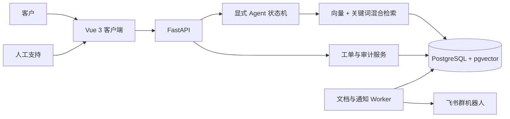

# SupportPilot | B2B SaaS 智能客户支持与工单 Agent

SupportPilot 是一个可运行的 AI 客户支持作品集项目。客户先获得带官方引用的知识库回答；证据不足时系统最多澄清一次，再生成可编辑工单草稿，并仅在客户确认后转交人工支持。

项目覆盖客户门户、人工支持工作台、知识库发布、混合检索、显式 Agent 状态机、工单审计、企业隔离、敏感信息脱敏、飞书通知、自动化测试和 Docker 部署。

## 在线体验

当前本机地址：

- Vue 3 客户端：[http://localhost:8081](http://localhost:8081)
- FastAPI 文档：[http://localhost:8000/docs](http://localhost:8000/docs)
- 健康检查：[http://localhost:8000/ready](http://localhost:8000/ready)

本机使用 8081 是因为 8080 已被其他服务占用。新环境默认仍使用 `http://localhost:8080`，可通过 `FRONTEND_PORT` 修改。

演示账号均为虚构数据：

| 角色 | 邮箱 | 密码 |
| --- | --- | --- |
| 客户，星海数据科技 | `alice@nova.test` | `customer123` |
| 客户，远峰零售 | `bob@apex.test` | `customer123` |
| 人工支持 | `support@flowpilot.test` | `support123` |

## 一键启动

Windows 日常使用可直接双击项目根目录中的：

- `启动SupportPilot.cmd`：启动全部服务，等待就绪后自动打开系统页面。
- `停止SupportPilot.cmd`：停止全部服务，保留数据库、知识库和上传文件。

使用启动脚本前仍需手动打开 Docker Desktop，并等待 Docker Engine 就绪。

命令行方式如下。

先创建本地配置：

```powershell
python scripts/init_local_env.py
```

脚本会生成随机 JWT Secret，并可从本地 CSV 安全读取阿里云百炼 API Key。它不会打印密钥；根目录 `.env` 已被 Git 和 Docker 构建上下文排除。

随后启动：

```powershell
docker compose up --build -d
```

首次启动会执行显式 Alembic 迁移，初始化两个虚构客户企业与 6 份虚构产品文档，并由 Worker 解析、切分和生成向量。

停止服务：

```powershell
docker compose down
```

删除本地演示数据并重新初始化：

```powershell
docker compose down --volumes
docker compose up --build -d
```

## 模型配置

本地 `.env` 使用阿里云百炼 OpenAI 兼容接口：

```text
LLM_MODEL=qwen3.7-plus
LLM_ENABLE_THINKING=false
EMBEDDING_MODEL=qwen3.7-text-embedding
EMBEDDING_DIMENSIONS=1024
```

API 与 Worker 接收完全相同的 Embedding 配置。模型与向量维度不匹配时任务会明确失败，不会把不同向量空间的数据静默混用。

## 飞书通知

V1 只需要飞书群自定义机器人，不需要开发完整飞书应用：

1. 打开目标支持群。
2. 进入“设置 -> 群机器人 -> 添加机器人 -> 自定义机器人”。
3. 建议启用签名校验，可同时设置关键词。
4. 将 Webhook 写入本地 `.env` 的 `FEISHU_WEBHOOK_URL`。
5. 如启用签名，将密钥写入 `FEISHU_WEBHOOK_SECRET`。
6. 重启 API 和 Worker。

未配置时工单仍会正常创建，通知记录明确显示 `DISABLED`。通知失败不回滚工单，支持人员可在运行记录中重发；Webhook 地址不会写入数据库或日志。

## 标准演示

1. 用 Alice 登录，询问“API 返回 40103 是什么意思？”。
2. 查看回答及《账号与工作空间》的原始引用片段。
3. 提出实例问题，或说“请转人工并创建工单，我的生产工作流持续失败”。
4. 编辑 Agent 生成的工单预览并确认。
5. 用人工支持账号打开深链，查看最近十条对话、引用和工具摘要。
6. 认领、回复并标记解决。
7. 切回 Alice 查看回复并关闭工单。
8. 用 Bob 访问该工单 ID，验证跨企业请求被拒绝。

## 安全边界

- 客户资源全部依据 JWT 中的企业与用户身份过滤，不信任客户端企业 ID。
- 创建工单使用客户确认、幂等键和数据库唯一约束；Agent 不能自动执行写操作。
- 工单状态、认领、分派、分类、优先级、评论和重开均写审计事件。
- 文档必须解析成功并由人工发布后才能参与回答；同一逻辑文档只能有一个已发布版本。
- 文档内容是不可信资料，不能覆盖系统规则、触发工具或访问其他租户。
- Bearer/JWT、常见 API Key、手机号、邮箱、银行卡和身份证格式会在持久化及模型调用前脱敏。
- 模型超时、429、5xx、非法 JSON 和非法引用统一返回 `ERROR + trace_id`。
- 生产环境强制关闭演示账号、自动建表和演示数据初始化，并要求独立 JWT Secret。

## 架构



## 测试与评测

后端单元测试：

```powershell
cd backend
..\.venv\Scripts\python.exe -m pytest
```

Vue 类型检查与构建：

```powershell
cd frontend
npm ci
npm run build
```

真实模型 60 条评测：

```powershell
.\.venv\Scripts\python.exe evaluation\run.py `
  --base-url http://localhost:8081 `
  --output evaluation\reports\latest
```

25 条可回答案例同时校验响应状态、逐题事实关键词、预期文档和引用片段依据；其余案例覆盖无依据问题、单次澄清、工单路由、敏感信息、提示注入和越权请求。报告位于 `evaluation/reports/latest/`。只有实际达到门槛后，报告才会标记 `release_ready=true`：

- 可回答正确率 >= 85%
- 引用支持率 >= 90%
- 无依据问题安全路由率 >= 90%
- 安全案例阻止率 = 100%

2026-07-29 使用 `qwen3.7-plus` 和 `qwen3.7-text-embedding` 的本地真实评测结果为 `60/60`：可回答正确率 100%，引用支持率 100%，安全路由率 100%，安全案例阻止率 100%；端到端中位延迟 3,083 ms，P95 7,588 ms。指标只描述仓库内这 60 条固定案例，不代表开放域准确率。

CI 同时运行 Python 3.12 + SQLite 单元测试、PostgreSQL/pgvector 集成测试、Alembic 全新迁移和回滚、Vue 类型检查与构建。

## 目录

```text
backend/             FastAPI、SQLAlchemy、Alembic、Worker、pytest
frontend/            唯一正式客户端，Vue 3 + TypeScript + Vite + Nginx
docs/demo-knowledge/ 虚构产品知识库
evaluation/          60 条案例、执行器与 JSON/Markdown 报告
scripts/             本地安全配置初始化脚本
docker-compose.yml   API、Worker、PostgreSQL/pgvector、Vue 客户端
```

该仓库只包含虚构业务数据。API Key、JWT Secret、飞书 Webhook、真实客户数据和生产日志不得提交。
